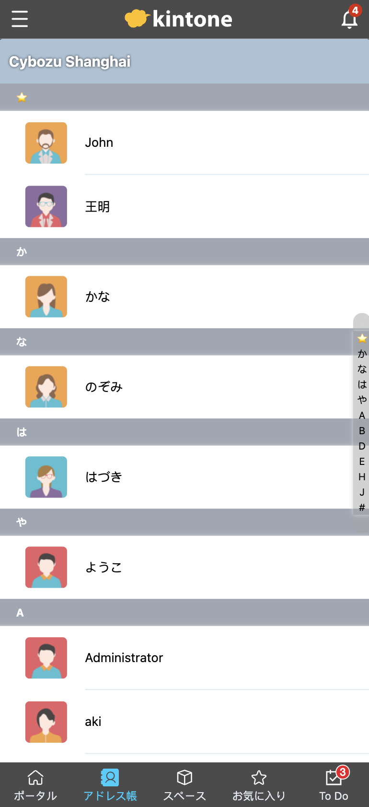

# sample-kintone-mobile-customize-CN
kintone mobile customize

## Install
```console
yarn
```
## https 
```
mkcert -install
mkcert localhost 127.0.0.1 ::1
```
Setting int the vue.config.js

## Import in kintone
Input templates and data from "kintone_templates"  
When importing data, please don't check "Key to Bulk Update"

## Complete .env
```console
mv .env.sample .env
```
complete .env

### kintone portal setting Info (serve mode)
https://localhost:8080/js/chunk-vendors.js
https://localhost:8080/js/app.js
https://localhost:8080/js/app-router.js

## Build

```console
yarn build
```


## Screenshots
     
