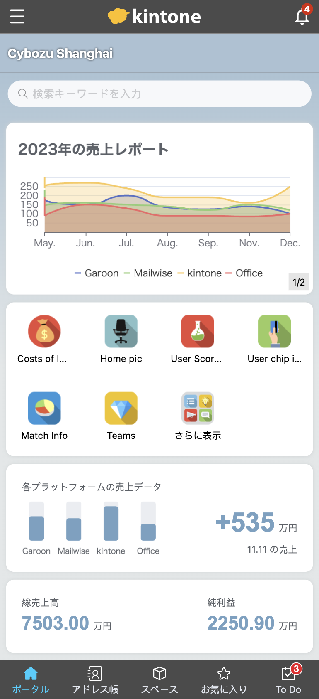
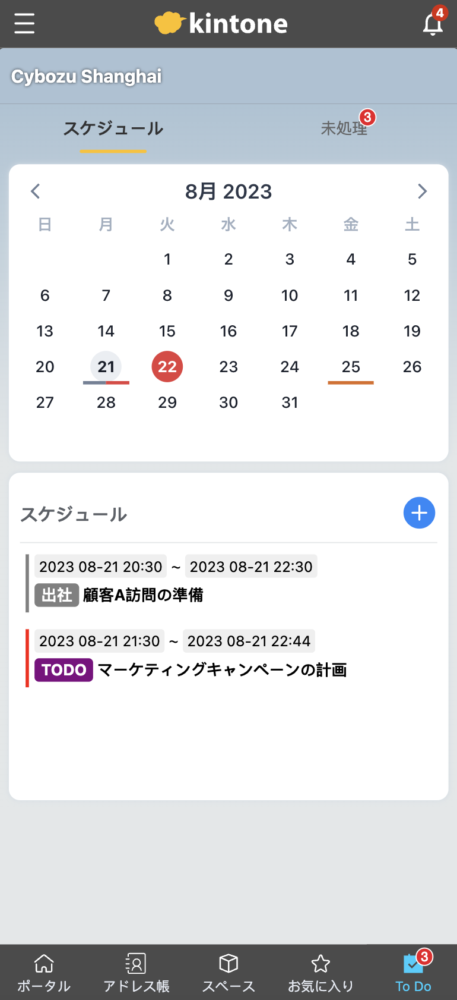

# sample-kintone-mobile-customize-CN
kintone mobile customize

## Install
```console
yarn
```

## Import in kintone
Input templates and data from "kintone_templates"  
When importing data, please don't check "Key to Bulk Update"

## Complete .env
```console
mv .env.sample .env
```
complete .env

### .env Info
```console
BASE_URL=                #kintone domain:"xxx.cybozu.com/cn"
USER_NAME=               #kintone username
PASSWORD=                #kintone password
APPCARDS=                #app id of "portaldesign-Cards-links"
BARCHARTS=               #app id of "双十一销量统计"
LINECHARTS=              #app id of "双十一销量统计"
PIECHARTS=               #app id of "双十一销量统计"
CALENDAR=                #app id of "todo Demo"
TODO=                    #app id of "todo Demo"
APPSDRAG=                #app id of "mobile首页应用展示"
BAIDUTONGJI_SITEID=      #百度统计（可选)
```

## Build

```console
mv .env.sample .env
yarn build
```

## Features 
- Tabbar
- 首页
  - echarts 图表
  - 收藏的应用
  - 应用分析
- 通讯录
- 空间
- 收藏（应用卡片）
- 待办
  - 日程
  - 未处理 

## Screenshots
    

  


